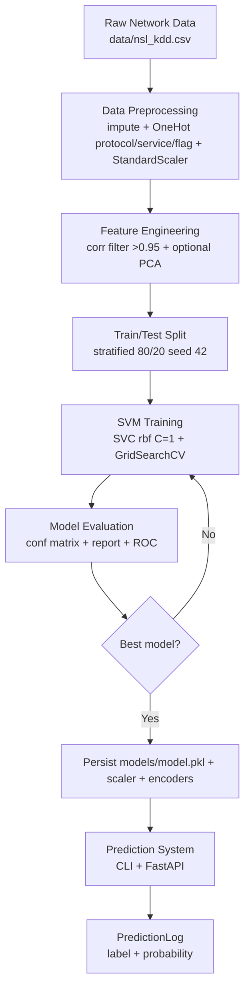
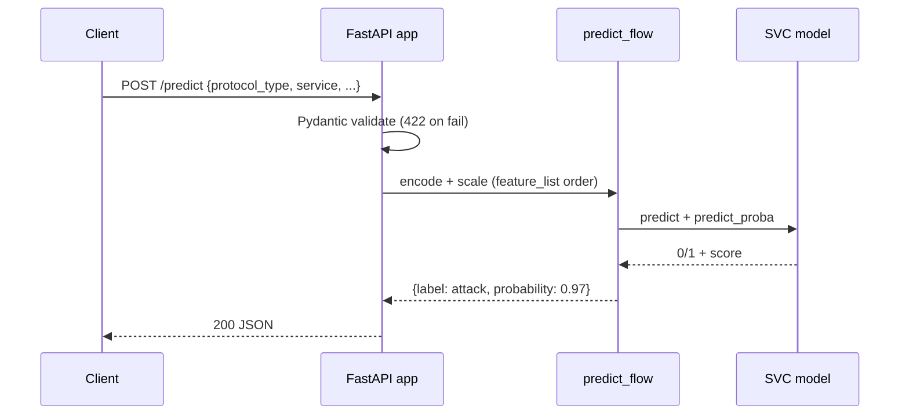

# DRD — Design & Dataflow Requirements Document
## Network Intrusion Detection System (SVM-Based)

| Field | Value |
|---|---|
| Version | 1.0 |
| Covers | System design, dataflow, component contracts, API/CLI design |
| Defers to | `trd.md` for versions, `erd.md` for entities, `edr.md` for metrics |

---

## 1. Design Goals

1. Mirror README architecture 1:1 so evaluator can trace each box to code.
2. Strict train/test isolation (no leakage) + deterministic reruns.
3. Thin inference path: `validate → encode → scale → SVC.predict` only.
4. Lab-demo friendly: one command per stage, plots + API in minutes.

## 2. System Context

Actors: Student (trains), Evaluator (re-runs), API Client (SOC script / curl) sending flow JSON, getting `normal/attack`.

```
[ CSV / API JSON ] → [ NIDS Pipeline ] → [ label + probability ]
                            ↓
                 [ models/ + metrics/ + plots/ ]
```

Out of scope: packet sniffer, auth, DB, dashboard (future).

## 3. Dataflow (authoritative — implements README diagram)



Stage → code → artifact:

| Stage | Module | Input → Output |
|---|---|---|
| Load | `src/data_loader.py::load_dataset()` | CSV → `DataFrame` (validated) |
| Preprocess | `src/preprocess.py::Preprocessor.fit/transform` | DF → `X_scaled`, encoder+scaler.pkl |
| Features | `src/features.py::select_features()` | `X_scaled` → `X_selected` + feature list |
| Split | `sklearn train_test_split` in `train.py` | `X,y` → `X_train/X_test` |
| Train | `src/train.py::train()` | train split → `model.pkl` + cv results |
| Evaluate | `src/evaluate.py::evaluate()` | model+test → `metrics.json` + 2 PNGs |
| Predict | `src/predict.py` + `app/main.py` | flow JSON → `{label, probability}` |

## 4. Component Contracts

### 4.1 `config.py`
Central constants: `DATA_PATH, MODEL_DIR, RANDOM_STATE=42, TEST_SIZE=0.2, CAT_COLS=[protocol_type,service,flag], PARAM_GRID={C:[0.1,1,10],kernel:[linear,rbf],gamma:[scale,auto]}, ATTACK_MAP`. All modules import from here — no hardcoded seeds/paths elsewhere.

### 4.2 `data_loader.py`
`load_dataset(path) -> (DataFrame, label_series)`: checks file exists, required columns present, maps `attack_type→label` (or uses `label` col if already binary), normalizes column names to lowercase. Raises `FileNotFoundError` / `ValueError(missing cols)` with actionable message.

### 4.3 `preprocess.py` — `Preprocessor` class
- `fit(df_train)`: fits SimpleImputer + OneHotEncoder + StandardScaler.
- `transform(df)`: applies same; `handle_unknown='ignore'` for unseen service/flag at inference.
- `save/load(dir)`: joblib round-trip. Never fit on test.

### 4.4 `train.py`
CLI: `python -m src.train --data <csv> --use-pca --official-split`. Steps: load → preprocess.fit(train) → features → split → baseline fit → GridSearchCV(cv=5, scoring=f1) → save best + log `best_params_`. Prints timing + shapes.

### 4.5 `evaluate.py`
CLI: `python -m src.evaluate`. Loads model+test split (re-runs preprocessing deterministically), computes all EDR metrics, writes `metrics/metrics.json`, `classification_report.txt`, `plots/confusion_matrix.png`, `plots/roc_curve.png`. Exits non-zero if artifacts missing.

### 4.6 `predict.py` + `app/main.py`
Shared `predict_flow(dict) -> (label, proba)` function used by both CLI and API — single inference implementation. API adds Pydantic validation + HTTP codes; CLI adds CSV batch mode.

## 5. Sequence Designs

**Training:**
```
User → train.py: --data csv
train.py → data_loader: DataFrame
train.py → Preprocessor.fit → scaler/encoders
train.py → GridSearchCV → best SVC
train.py → models/*.pkl + metrics/cv_results.json
```

**Inference:**


## 6. API / CLI Design

| Interface | Contract |
|---|---|
| `GET /health` | `200 {"status":"ok","model_loaded":true}`; `503` if artifacts missing |
| `POST /predict` | In: raw flow JSON. Out: `{"label":"attack","probability":0.97}`. `422` on schema error |
| `POST /predict_batch` | In: `{"rows":[{...},{...}]}`. Out: `{"predictions":[...]}` |
| CLI single | `python -m src.predict --single '{"protocol_type":"tcp",...}'` |
| CLI batch | `python -m src.predict --input in.csv --output preds.csv` |

Pydantic schema accepts all NSL-KDD raw columns as optional-with-defaults for demo flexibility, but rejects empty body.

## 7. Error Handling & Logging

- Missing CSV → `FileNotFoundError: data/nsl_kdd.csv not found. See data/README.md for download links.`
- Missing columns → `ValueError: missing columns [...]`.
- Missing model at API startup → log warning + `/health model_loaded:false`, `/predict → 500 run python -m src.train first`.
- All runs log `shapes, params, timings` to stdout + `metrics/run.log`.

## 8. Test Design (maps to `tests/test_smoke.py`)

1. Loader test on `sample_nsl_kdd.csv`.
2. Preprocess outputs no NaN + stable column count.
3. Train on 200-row subset fits + predicts 0/1.
4. API schema validates sample flow.
5. `feature_list.json` round-trip preserves inference order.

## 9. Future Hooks (not built in v1)

Packet-capture adapter interface (`src/capture.py` stub), model registry versioning, SQLite `PredictionLog` table per ERD, Streamlit dashboard. Stubs documented but not implemented.
