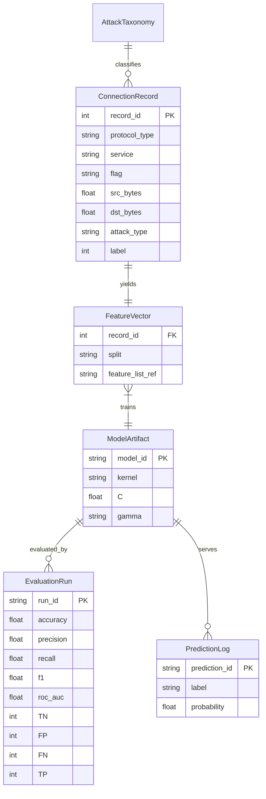

# ERD — Entity Relationship Document
## Network Intrusion Detection System (SVM-Based)

> v1 has no RDBMS — filesystem (CSV + pickle + JSON) is the store. This ERD defines the **logical entities**, attributes, and relationships so a SQLite/Postgres migration later is trivial, and so `preprocess / train / predict` handle schemas consistently.

## 1. Entities & Attributes

### 1.1 ConnectionRecord (raw row from NSL-KDD / CICIDS)
| Attr | Type | Notes |
|---|---|---|
| record_id | INT PK | row index |
| duration, src_bytes, dst_bytes, count, srv_count, ... (38 numeric) | FLOAT/INT | flow statistics |
| protocol_type | ENUM(tcp,udp,icmp) | categorical |
| service | STRING (~70 vals: http, ftp, smtp, ...) | categorical |
| flag | STRING (~11 vals: SF, S0, REJ, ...) | categorical |
| attack_type | STRING NULL | raw label e.g. `neptune, smurf, satan, normal` |
| label | INT (0 normal / 1 attack) | derived: `0 if attack_type==normal else 1` |
| source | STRING | `nsl_kdd.csv` vs `sample` vs `api_input` |
| created_at | DATETIME | ingest time |

### 1.2 FeatureVector (post-preprocessing, model-ready)
| Attr | Type | Notes |
|---|---|---|
| record_id | INT FK → ConnectionRecord | 1–1 |
| features | VECTOR[FLOAT] | scaled + one-hot + pruned, order = `feature_list.json` |
| split | ENUM(train,test) | stratified 80/20, seed 42 |
| scaler_version | STRING | hash of scaler.pkl |
| encoder_version | STRING | hash of encoders.pkl |

### 1.3 ModelArtifact
| Attr | Type | Notes |
|---|---|---|
| model_id | STRING PK | e.g. `svm_rbf_C1_20260909` |
| kernel | ENUM(linear,rbf) | from grid |
| C, gamma | FLOAT/STRING | hyperparams |
| feature_list | JSON | column order, length = n_features |
| train_rows, test_rows | INT | dataset sizes |
| trained_at | DATETIME | |
| file_path | STRING | `models/model.pkl` |

### 1.4 EvaluationRun
| Attr | Type | Notes |
|---|---|---|
| run_id | STRING PK | |
| model_id | FK → ModelArtifact | N–1 (one model, many evals) |
| accuracy, precision, recall, f1, roc_auc, fpr, fnr | FLOAT | see edr.md for formulas |
| confusion_TN/FP/FN/TP | INT | |
| best_params | JSON | GridSearchCV output |
| report_path | STRING | `metrics/metrics.json` |
| plot_cm / plot_roc | STRING | `plots/*.png` |

### 1.5 PredictionLog (what the API returns)
| Attr | Type | Notes |
|---|---|---|
| prediction_id | STRING PK | uuid |
| model_id | FK → ModelArtifact | which model served it |
| input_features | JSON | raw flow as received |
| label | ENUM(normal,attack) | `1→attack, 0→normal` |
| probability | FLOAT 0–1 | `predict_proba` attack score |
| latency_ms | FLOAT | |
| predicted_at | DATETIME | |

### 1.6 AttackTaxonomy (reference, not trained in v1 binary mode)
`attack_type → category`: `neptune/smurf→DoS`, `satan/portsweep→Probe`, `guess_passwd→R2L`, `buffer_overflow→U2R`, `normal→Normal`. Used for per-type recall analysis.

## 2. Relationships

- `ConnectionRecord 1 — 1 FeatureVector` (each raw row yields one scaled vector)
- `FeatureVector N — 1 ModelArtifact` (many rows train one model)
- `ModelArtifact 1 — N EvaluationRun` (retune / re-eval creates runs)
- `ModelArtifact 1 — N PredictionLog` (one deployed model serves many predictions)
- `AttackTaxonomy 1 — N ConnectionRecord` (each record maps to one category)

## 3. Physical Mapping (v1, no SQL)

| Entity | File |
|---|---|
| ConnectionRecord | `data/nsl_kdd.csv` / `data/sample_nsl_kdd.csv` |
| FeatureVector | in-memory `X_train/X_test` + `models/feature_list.json` |
| ModelArtifact | `models/model.pkl + scaler.pkl + encoders.pkl + feature_list.json` |
| EvaluationRun | `metrics/metrics.json + classification_report.txt` |
| PredictionLog | API response JSON (optionally appended to `metrics/predictions.csv`) |
| AttackTaxonomy | `src/config.py :: ATTACK_MAP` dict |

If a DB is added later: one table per entity, `record_id/model_id/run_id/prediction_id` as PKs, foreign keys as above; `features/input_features/feature_list` as JSONB.

## 4. Integrity Rules

1. Encoder/scaler fitted on **train only**; test/inference reuse same artifacts (no refit).
2. Inference column order must equal `feature_list.json` — mismatch → 422 error, never silent reorder.
3. `label` is always binary 0/1; raw `attack_type` preserved separately for analysis.
4. Every `EvaluationRun` must reference the exact `model_id` + data hash that produced it.
